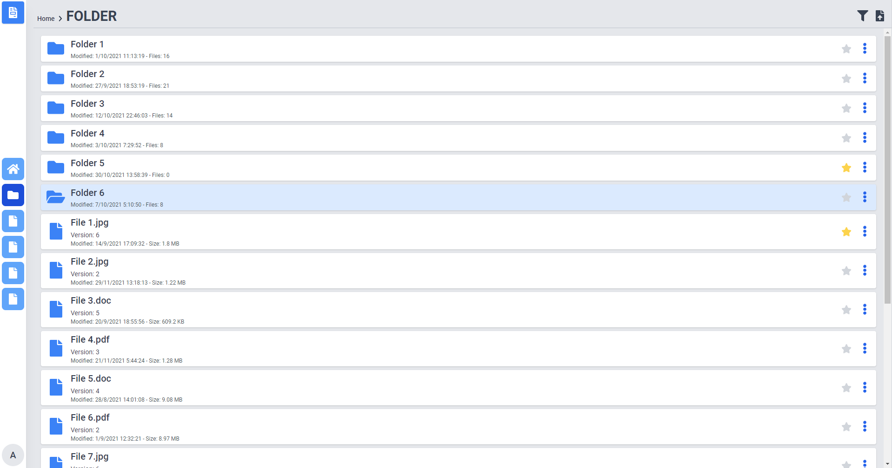
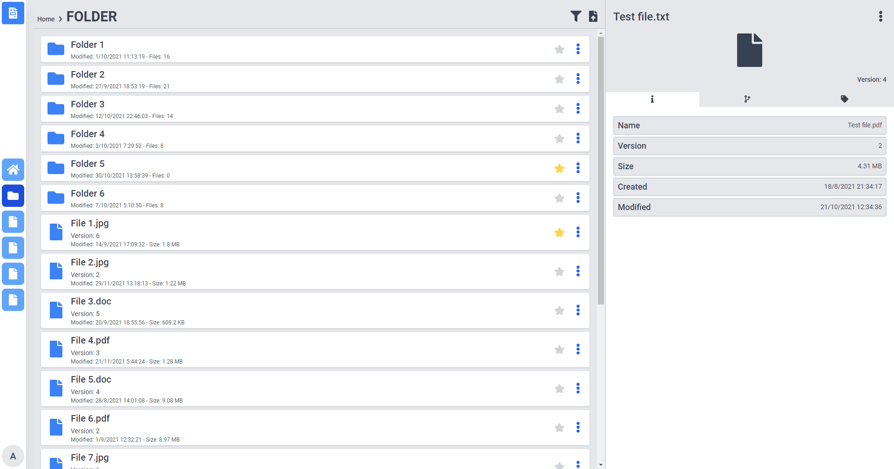
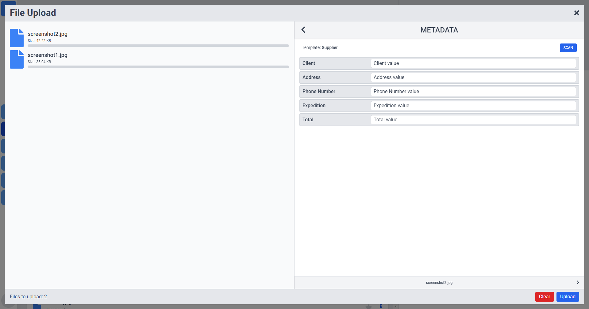

# DMS Prototype

## Project setup

```
npm install
```

### Compiles and hot-reloads for development

```
npm run serve
```

### Compiles and minifies for production

```
npm run build
```

## Description

Early prototype of a DMS able to parse files applying an OCR template to be saved for use in an ERP app.

**Data is randomly generated, some functionality is not implemented**

**Frontend only**.

### Explorer

Basic information about folders and files, clicking on a folder change the current folder, clicking on a file display information about the file. On the left bar there is a list of icons of favorited files and folders for fast navigation.



### File

Displays info about the selected file, contains three different tabs:

-   General information
-   Version history
-   Metadata (Can be modified)



### Upload

File upload window, can select multiple files to upload, select a template and scan the file to collect the data especified in the OCR Template.


